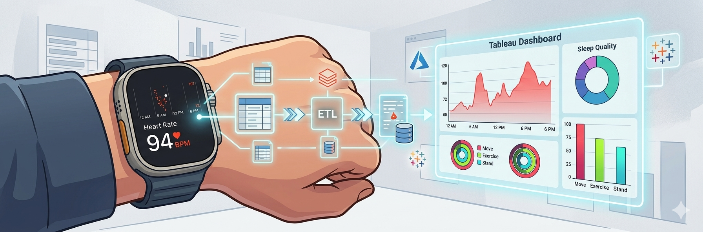
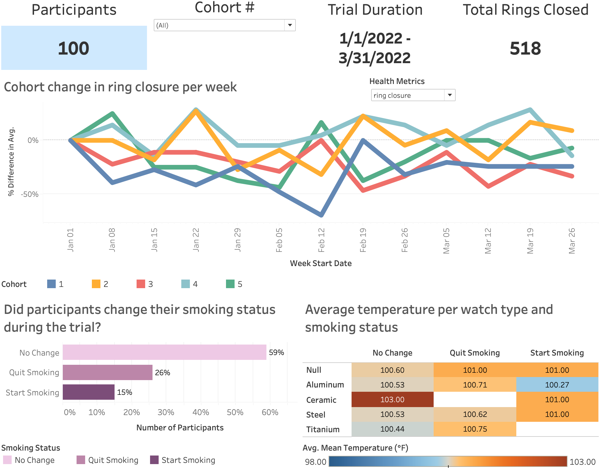

# Apple Watch Health Analytics

### *Build an interactive Tableau dashboard and a Databricks medallion architecture pipeline from a simulated Apple Watch study.*



### Table of Contents
* [Introduction](#Introduction)
* [Tableau Dashboard](#Tableau-Dashboard)
* [Databricks Pipeline](#Databricks-Pipeline)
    * [A. Pipeline Architecture](#A-Pipeline-Architecture)
    * [B. Key Transformations](#B-Key-Transformations)
    * [C. Business Logic](#C-Business-Logic)
    * [D. Final Output](#D-Final-Output)
    * [E. Data Quality Highlights](#E-Data-Quality-Highlights)
* [Future Directions](#Future-Directions)

### Introduction

The purpose of this study is to use the following two datasets to generate insights on a simulated experimental study. Participants were asked to wear an Apple Watch and record several aspects of their activity and health at three different timepoints. Some aspects of the participants changed over the course of the trial, e.g. smoking status. These aspects were recorded in the first dataset, [**health_irreg_rhythm**](Data/health_irreg_rhythm.csv).

Participants were also organized into cohorts: groups of individuals to help facilitate the study. Each cohort’s average temperature was aggregated for each month of the study and is stored in a second dataset, [**health_cohort_monthly**](Data/health_cohort_monthly.csv).

The detailed schemas of the two tables are as follows:

**health_irreg_rhythm**
- `id`: A unique identifier for the participant
- `date`: Date participant recorded their data
- `smoker`: "yes" if the person smokes, "no" if they don't
- `rings_closed`: Median number of rings closed per day
- `watch_type`: The material type for the Apple Watch
- `diff_exer_types`: Median of different types of exercise types per week
- `max_hr`: Maximum heart rate recorded during the week
- `irreg_rhythm`: "1" if the person exhibited irregular heart rhythm; "0" if they did not.
- `cohort`: The group of the participant in the study

**health_cohort_monthly**
- `cohort`: The group of the participant in the study
- `month`: Month of the study
- `mean_temp`: The average temperature of the cohort during the specified month

### Tableau Dashboard

The interactive Tableau dashboard shown below provides a comprehensive look at health analytics for this simulated experimental study over a three-month trial period from January to March 2022. While specific cohort treatments and detailed demographic information are not available, the dashboard visualizes key longitudinal trends and correlations across multiple metrics.

[](https://public.tableau.com/views/Apple-Watch-Health-Analytics/Dashboard2?:language=en-US&:sid=&:redirect=auth&:display_count=n&:origin=viz_share_link)

Key features of the analysis include:

- **Weekly Cohort Trends**: The main line chart tracks the percent difference in average health metrics, such as "ring closure," across five different cohorts over the course of the trial.

- **Smoking Status Dynamics**: A dedicated bar chart reveals participant behavior changes, showing that while 59% of participants maintained their smoking status, 26% quit and 15% started smoking during the study.

- **Body Temperature Analysis**: The heatmap investigates potential relationships between average body temperature (ranging from 98.00°F to 103.00°F), smoking status changes, and Apple Watch hardware types, such as Aluminum, Ceramic, Steel, and Titanium.

- **Interactive Exploration**: Users can filter the data by cohort number and toggle between different health metrics to perform their own self-guided exploration of the dataset.

### Databricks Pipeline

We implements a medallion architecture (Bronze → Silver → Gold) data pipeline to analyze data from this Apple Watch simulated experimental study. The details can be found in the following notebook:

[**Apple Watch Health Imperative Pipeline Notebook**](Apple_Watch_Health_Imperative_Pipeline.ipynb)

#### A. Pipeline Architecture

**Bronze Layer (Raw Data)**

Table: `health_irreg_rhythm_bronze`

* Direct ingestion from CSV files in Unity Catalog Volume
* Location: `/Volumes/workspace/linkprojects_apple_watch/rawdata/`
* No transformations applied
* Preserves all original data as-is

**Silver Layer (Cleaned & Standardized)**

View: `health_irreg_rhythm_silver_fixed`

Data quality issues identified and resolved:

1. **Date Standardization**
   * Issue: Mixed date formats ("MMM-d-yyyy" and "M/d/yy")
   * Solution: Pattern matching with RLIKE and format-specific conversion
   * New column: `date_fixed`

2. **Boolean Conversion**
   * Issue: Smoking status stored as strings ("yes", "no", "n")
   * Solution: Converted to boolean (True/False)
   * New column: `smoker_fixed`

3. **Invalid Ring Data**
   * Issue: Ring count of 4 (Apple Watch only has 3 rings)
   * Solution: Replaced 4 with 3 (likely data entry error)
   * New column: `rings_closed_fixed`

4. **Heart Rate Outliers**
   * Issue: Physiologically impossible value (1600 bpm)
   * Solution: Replaced with median of valid values
   * New column: `max_hr_fixed`

5. **Cohort Assignment Error**
   * Issue: Participant ID 3 had mixed cohort assignments (1 entry in cohort 3, 2 in cohort 4)
   * Expected: Each participant should have exactly 3 entries in the same cohort
   * Solution: Reassigned participant 3's cohort 3 entries to cohort 4
   * New column: `cohort_fixed`

**Gold Layer (Business-Ready Analytics)**

Table: `smoking_categorized_gold`

Aggregated data for smoking behavior analysis:

* Uses window functions to track smoking status changes over time
* Categorizes participants into 5 smoking behavior groups:
  1. **Did Not Change** - Consistent smoking status throughout study
  2. **Started Smoking** - Non-smoker → smoker
  3. **Quit Smoking** - Smoker → non-smoker
  4. **Started Then Quit** - Non-smoker → smoker → non-smoker
  5. **Quit Then Restarted** - Smoker → non-smoker → smoker

#### B. Key Transformations

**Smoking Timeline Analysis**
```sql
-- Rank each participant's timepoints chronologically
ROW_NUMBER() OVER (PARTITION BY id ORDER BY date_fixed) as timepoint

-- Track first, middle, and last smoking status
MAX(CASE WHEN timepoint = 1 THEN smoker_fixed END) as first_status
MAX(CASE WHEN timepoint = 2 THEN smoker_fixed END) as middle_status
MAX(CASE WHEN timepoint = total_timepoints THEN smoker_fixed END) as last_status
```

#### C. Business Logic
Used CASE statements to classify behavior patterns based on:
* Initial vs. final smoking status
* Total number of smoking observations
* Middle timepoint status (for detecting quit-and-restart or start-and-quit patterns)

#### D. Final Output

The pipeline produces a summary table showing:
* `smoking_category`: Behavior classification
* `participant_count`: Number of participants in each category
* `percent_of_participants`: Percentage distribution across categories

| smoking_category | participant_count | percent_of_participants |
|---|---|---|
| **Did Not Change** | 30 | 30.0 |
| **Started Smoking** | 16 | 16.0 |
| **Quit Smoking** | 16 | 16.0 |
| **Started Then Quit** | 27 | 27.0 |
| **Quit Then Restarted** | 11 | 11.0 |

#### E. Data Quality Highlights

* ✓ Standardized date formats
* ✓ Type conversions (string → boolean)
* ✓ Outlier detection and remediation
* ✓ Data entry error correction
* ✓ Cohort assignment validation
* ✓ Preserved all original data in bronze layer for auditability

### Future Directions

Potential extensions:
* Create a Spark Declarative Pipelines (SDP) with less code, automatic orchestration, and built-in data quality expectations
* Analyze correlations between smoking status changes and other health metrics
* Build predictive models for irregular heart rhythm based on lifestyle factors